# AKMA Platform

**Business systems design case study for construction and finishing operations**

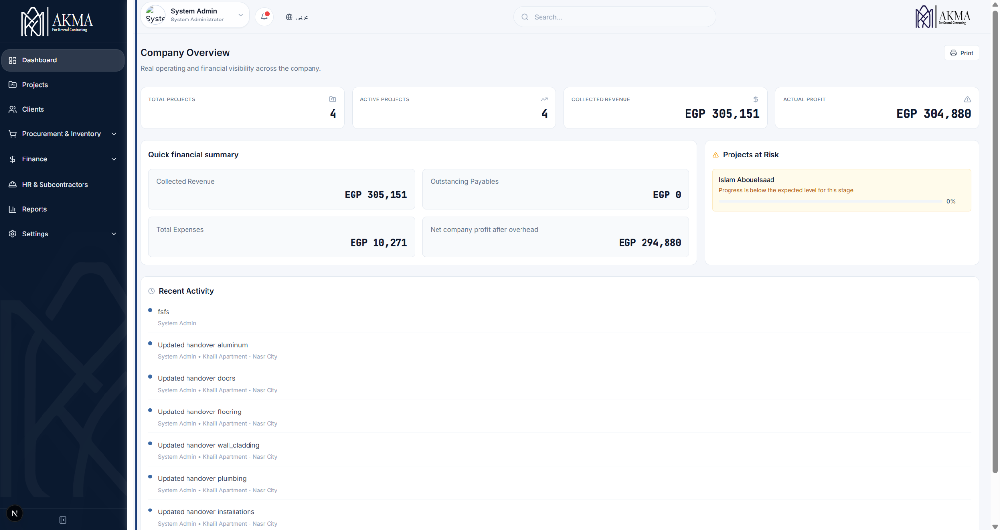

## Overview

AKMA Platform is a project-centric internal business system designed for construction and finishing operations.

It connects projects, areas, procurement, expenses, revenues, reporting, and internal support workflows inside one structured platform. The goal is not just data entry, but clear operational visibility, controlled actions, and better decision-making across daily work.

This repository is a **product showcase**, not an open-source release of the production code.

## What this project demonstrates about my work

This project reflects the kind of work I do from the business and product side:

- translating real operational needs into structured digital workflows
- defining product modules and the relationships between them
- designing system logic, permissions, user actions, and reporting visibility
- shaping interfaces around operational clarity, not just visual layout
- using AI-assisted prototyping to accelerate iteration while keeping human-led product direction

## Core system capabilities

- client and project management
- project-centered workspaces with financial visibility
- area and room-level tracking
- initial handover by finishing category
- BOQ and estimation structure
- procurement workflow and supplier comparison
- price timeline and residual material logic
- invoices, expenses, and client revenue tracking
- report and export workflows
- user management and role-based access
- internal IT helpdesk and in-app notifications
- bilingual Arabic / English usage with RTL / LTR support

## Why the system matters

Construction and finishing businesses often suffer from scattered records, manual follow-up, weak reporting, and disconnected operational steps.

AKMA was designed to solve that by turning day-to-day operational workflows into one connected system where project structure, room progress, procurement, finance, permissions, and support can all work together.

## Selected product strengths

### 1. Project-centered structure
The platform organizes work around real projects, not disconnected records. This improves traceability across procurement, expenses, revenues, rooms, and reporting.

### 2. Room-level operational tracking
Progress is not treated as a generic percentage. The system supports room and area-level tracking so execution status becomes easier to understand and follow.

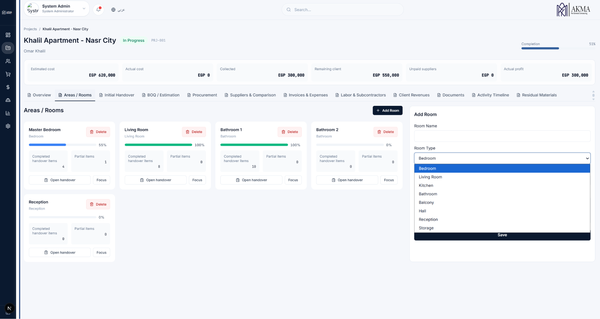

### 3. Real workflow logic
The platform reflects actual business sequences such as procurement request, supplier comparison, purchase flow, receipt, reporting, and support handling.

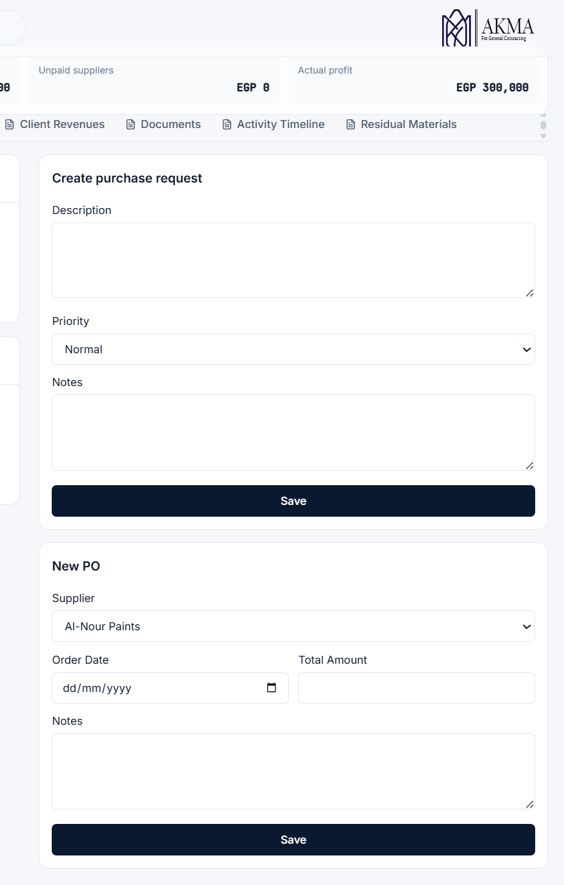

### 4. Decision-oriented dashboards
The dashboard and project overview screens are built to improve visibility, not just display numbers.

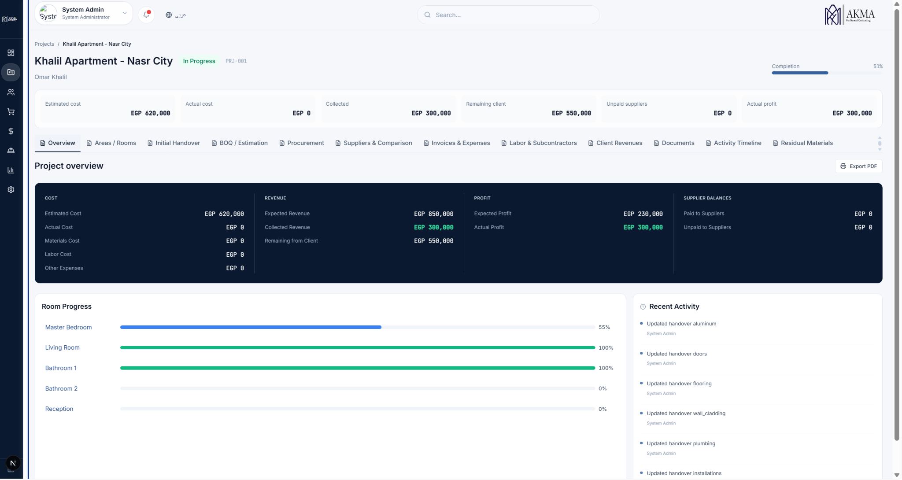

### 5. Reporting and export thinking
Reports and export previews were treated as part of the product logic, because real business use depends on clear printable outputs and branded reporting.

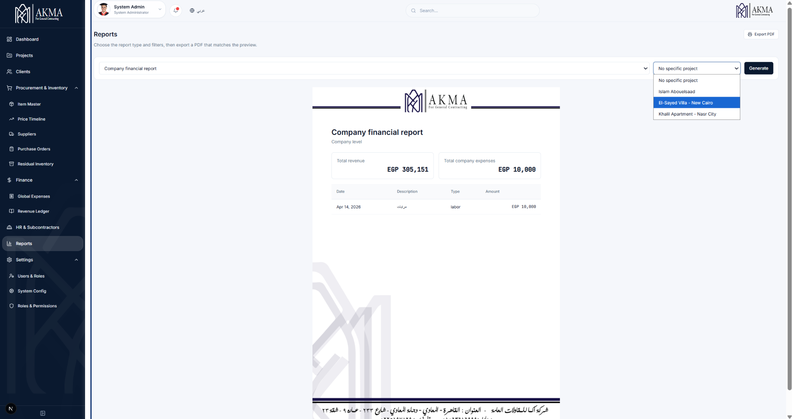

### 6. Internal support workflow
The system includes an internal support direction with ticket replies and notification behavior inside the platform.

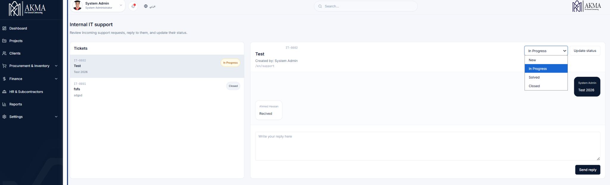

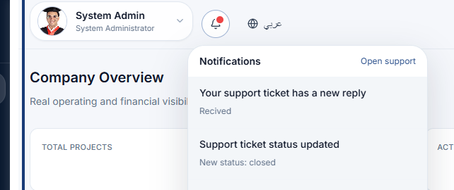

### 7. Business rules and governance
The product direction includes user visibility, controlled actions, permission readiness, and rules that protect data integrity across the workflow.

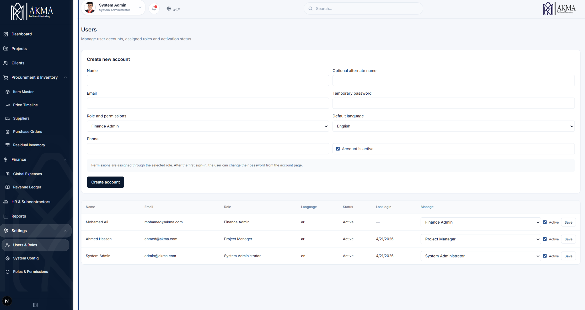

## Additional UI Screens

### Login
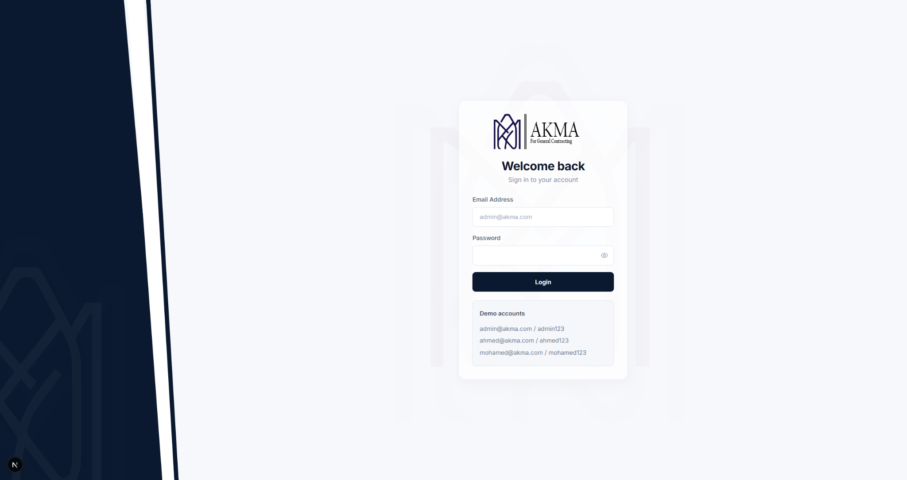

### Company Dashboard


### Initial Handover
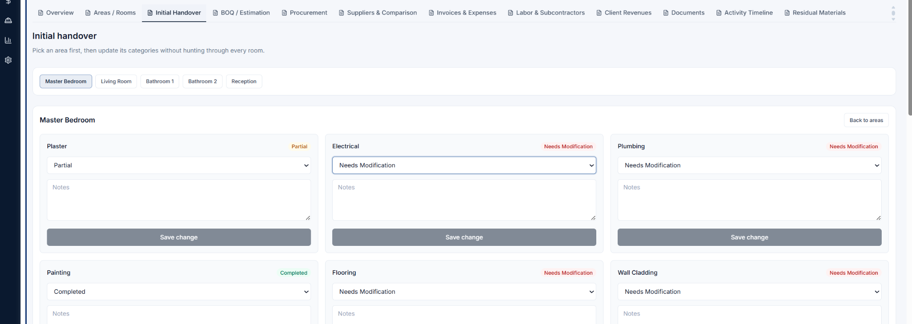

### Price Timeline
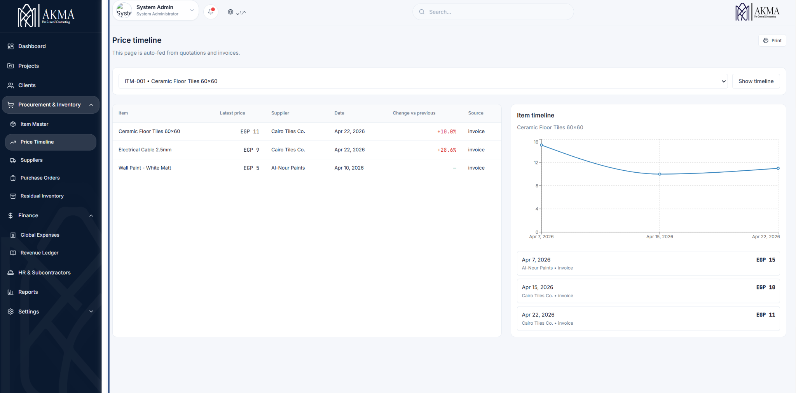

## My role

I worked on this product from the **business systems and product design side**.

My role included:
- identifying real operational pain points
- defining modules and business flows
- structuring user actions and data relationships
- shaping progress logic, reporting logic, and permissions direction
- guiding the product through AI-assisted iteration and refinement

I was not positioning myself here as a traditional software engineer. The value of my role was in turning operational complexity into a system that could be structured, validated, and built.

## Repository structure

```text
.
├─ README.md
├─ CHANGELOG.md
├─ VERSIONING_RULES.md
├─ RELEASE_TEMPLATE.md
├─ GITHUB_UPLOAD_STEPS.md
├─ screenshots/
└─ docs/
```

## Documentation

Additional supporting documents are available inside the `docs/` folder:
- project overview
- module map
- workflows
- roles and permissions
- reporting and printing
- version history
- AI-assisted build process

## Notes

- The production code is not included in this repository.
- The platform was built for a real business context.
- This repository is intended to present the product direction, workflow logic, and selected system screens.
- Sensitive company data should always be removed or blurred before publishing screenshots.

## Versioning

The project follows this version format:

`akma V<major>.<minor>.<patch>`

The locked reference version is `akma V2.02.01`.
